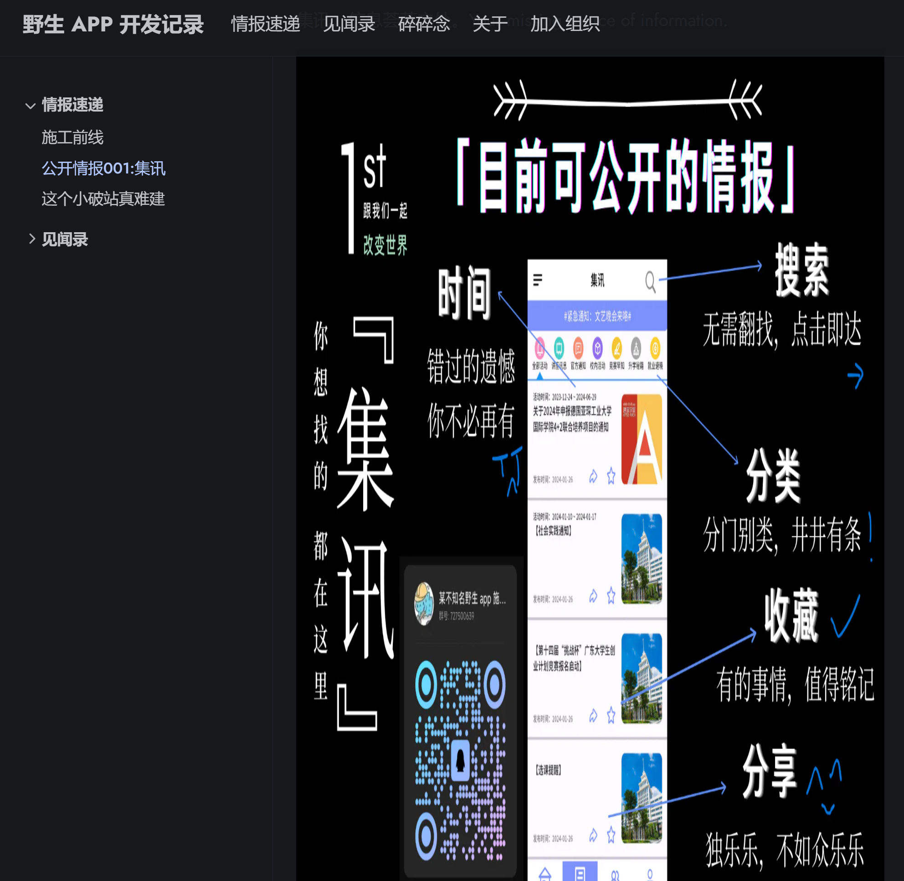

插入个图片都折腾了我好久，令人感叹。

这是一个成功的例子，那不成功的例子呢...

最开始是一个总是被裁切的版本。经过我的一番调查，调了 Hugo 各种处理图片的参数，又调了各种主题自带的图片处理库的参数，发现不好使。试着更新了一下依赖，就变成了这个超级拉伸版本...

最后查到了一个 [GitHub Issue](https://github.com/gethyas/images/issues/21)，手动添加样式之后解决了。

看起来这个是 Manual Installation 的步骤，我主题自带依赖怎么还要这样设置，说好的 battery included 呢？

唉，灵车。
